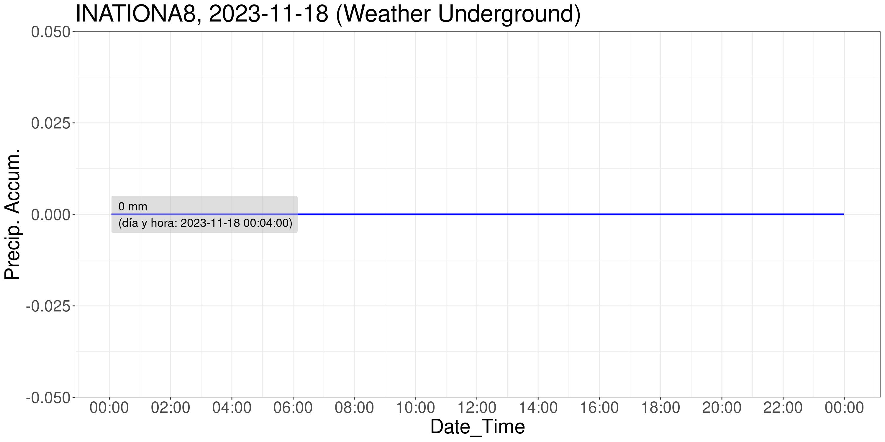
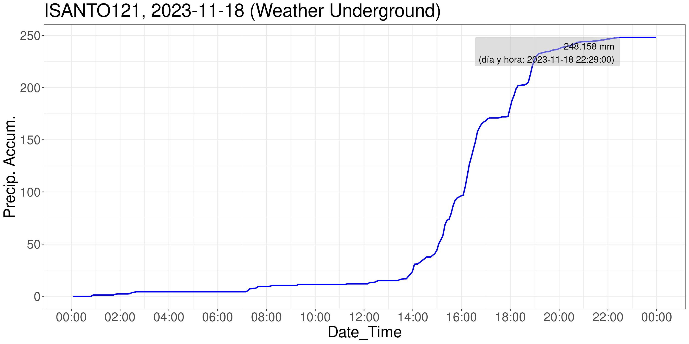
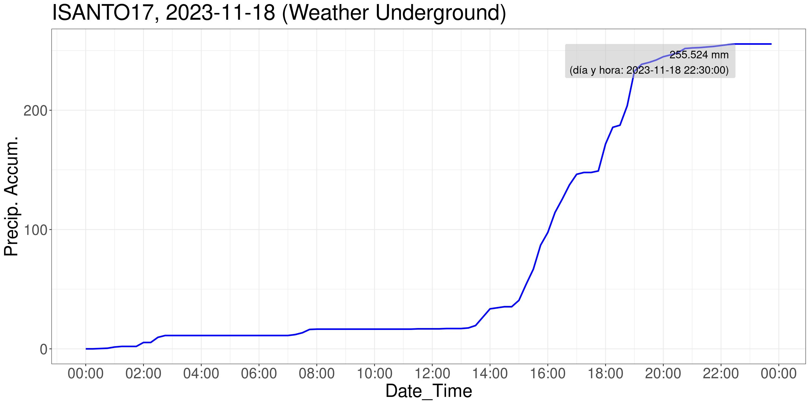
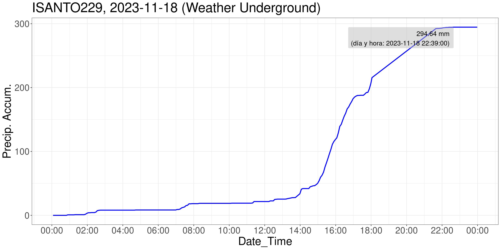
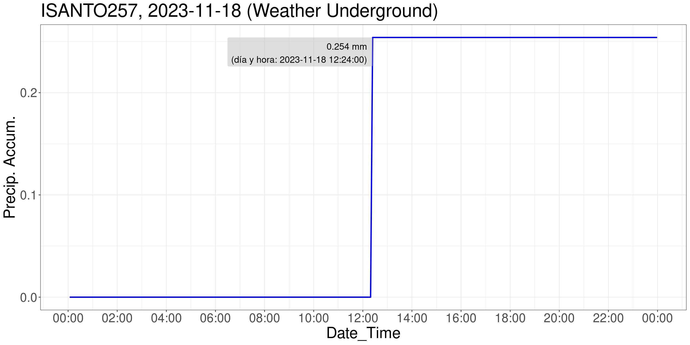
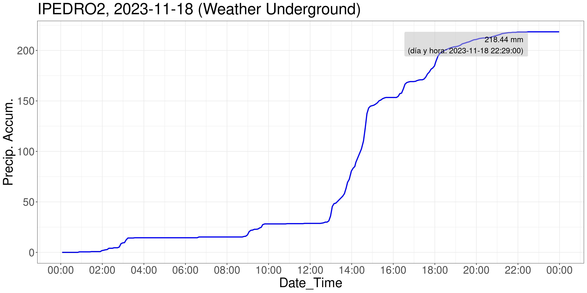
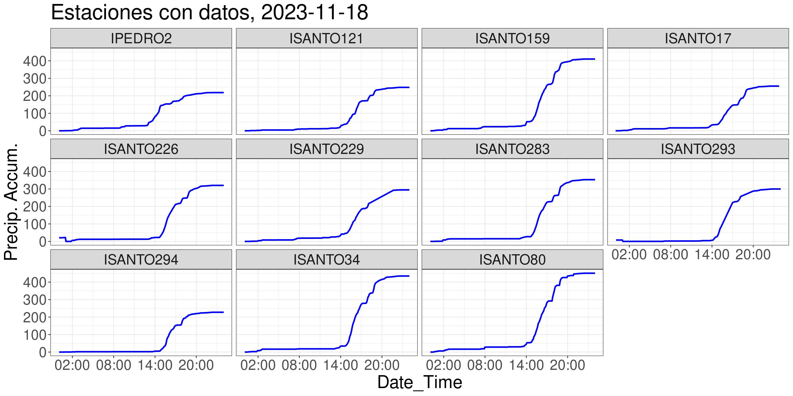

Análisis de datos de precipitación del 18 de noviembre de 2023 en la
ciudad de Santo Domingo
================
José Martínez

# Paquetes

``` r
library(tidyverse)
library(readODS)
library(lubridate)
library(stringi)
library(rvest)
library(parzer)
library(leaflet)
library(leaflet.extras)
library(sf)
library(RColorBrewer)
source('R/funciones.R')
dir_figuras <- 'img'
dir_datos <- 'data'
descargar <- F
Sys.setlocale("LC_TIME", "en_US.UTF-8")
```

# Obtención de los datos de las estaciones de Santo Domingo por medio de web scraping (“*a falta de pan-API, casabing*”)

<!-- Basado en: https://statsandr.com/blog/web-scraping-in-r/ -->

Coordenadas.

``` r
estaciones_coord_sd <- read_ods('estaciones-coordenadas.ods')
estaciones_coord_sd_corr <- cbind(estaciones_coord_sd, parse_llstr(estaciones_coord_sd$coord))
estaciones_coord_sd_corr_sf <- estaciones_coord_sd_corr %>% st_as_sf(coords = c('lon', 'lat'))
# estaciones_coord_sd_corr %>% write_csv('estaciones-coordenadas-corregidas.csv')
```

Fecha y estaciones.

``` r
fecha <- '2023-11-18'
estaciones <- c('INATIONA8', 'ISANTO34', 'ISANTO80', 'ISANTO121', 'ISANTO159',
                'ISANTO17', 'ISANTO218', 'ISANTO294', 'ISANTO283', 'ISANTO226',
                'ISANTO229', 'ISANTO257', 'ISANTO293', 'IPEDRO2')
```

Web scraping.

``` r
invisible(sapply(estaciones, function(id_estacion) {
  tryCatch(
    expr = {
      link <- construir_url(fecha_sel = fecha, id_estacion_sel = id_estacion)
      datos_descargados <- read_html(link)
      Sys.sleep(5)
      datos_descargados_css <- datos_descargados %>% html_elements(css = '.scrollable')
      tabla_de_css <- datos_descargados_css[[1]] %>% html_table()
      tabla <- tabla_de_css %>%
        mutate(across(everything(), clean_and_convert)) %>% 
        mutate(Time = clean_and_convert_time(Time)) %>% 
        mutate(Date_Time = as.POSIXct(paste(fecha, Time), format="%Y-%m-%d %I:%M %p"))
      p <- graficar(id_estacion_sel = id_estacion, tabla_sel = tabla)
      guardar_grafico(grafico = p, id_estacion_sel = id_estacion)
      guardar_tabla(tabla_sel = tabla, id_estacion_sel = id_estacion)},
    error = function(cond) {
      message("Se detectó un error", appendLF = TRUE)
      message('Esta información podría ayudar a depurar: ', cond, appendLF = TRUE)
      message('\nSaliendo...')},
    warning = function(warn) {
      message("Hubo una advertencia", appendLF = TRUE)
      message('Mostrando la advertencia a continuación: ', warn, appendLF = TRUE)},
    finally = {
      message('Gráfico generado satisfactoriamente')}
      )
}))
```

Gráficos

















Uniendo resultados.

``` r
# Crea una lista con los nombres de archivo CSV en la carpeta 'datos'
archivos_csv <- list.files(path = "data", pattern = "\\.csv$", full.names = TRUE)

# Lee cada archivo CSV y combínalos en un solo dataframe
todos_los_datos <- archivos_csv %>%
  map(~ read_csv(.x) %>% select(`Precip. Accum.`, Date_Time) %>% mutate(Station = gsub('\\.csv|data/', '', .x))) %>%  # map_dfr si quieres combinar en un solo dataframe
  bind_rows()
# todos_los_datos %>% write_csv(file = paste0(dir_datos, '/todos/todos_los_datos.csv'))
todos_los_datos_filtrados <- todos_los_datos %>%
  mutate(Date_Time = with_tz(Date_Time, tzone = "America/Santo_Domingo")) %>% 
  group_by(Station) %>% 
  mutate(Zero = sum(`Precip. Accum.`, na.rm = T)) %>% 
  ungroup() %>% 
  filter(!Zero <= 10) %>% 
  select(-Zero)
todos_los_datos_max <- todos_los_datos_filtrados %>% 
  group_by(Station) %>% 
  summarise(`Max (mm)` = max(`Precip. Accum.`, na.rm = T) * 25.4)
todos_los_datos_max %>% knitr::kable(caption = paste0('Valor máximo acumulado, estaciones con datos de Weather Underground, Santo Domingo', ' (', fecha, ')'))
```

| Station   | Max (mm) |
|:----------|---------:|
| IPEDRO2   |  218.440 |
| ISANTO121 |  248.158 |
| ISANTO159 |  410.210 |
| ISANTO17  |  255.524 |
| ISANTO226 |  320.294 |
| ISANTO229 |  294.640 |
| ISANTO283 |  353.060 |
| ISANTO293 |  299.720 |
| ISANTO294 |  227.584 |
| ISANTO34  |  434.848 |
| ISANTO80  |  450.850 |

<span id="tab:unnamed-chunk-6"></span>Table 1: Valor máximo acumulado,
estaciones con datos de Weather Underground, Santo Domingo (2023-11-18)

``` r
p <- graficar_panel(tabla_sel = todos_los_datos_filtrados, facet_var = 'Station', intervalo_mins = 360) +
  labs(title = paste0('Estaciones con datos, ', fecha))
guardar_grafico(grafico = p, id_estacion_sel = 'todos-los-datos')
```



Mapa.

``` r
# Crear una paleta de colores basada en los valores de 'Max (mm)'
valores_max <- todos_los_datos_max$`Max (mm)`  # Asume que esta columna contiene los valores numéricos máximos
pal <- colorNumeric(palette = "Blues", domain = valores_max)
leaflet(estaciones_coord_sd_corr_sf %>%
          inner_join(todos_los_datos_max %>% rename(id_estacion = Station))) %>%
  addCircleMarkers(
    radius = 8,
    # Usar la paleta para el color del marcador basado en el valor 'Max (mm)'
    fillColor = ~ pal(`Max (mm)`),
    # Personalizar el popup para mostrar el id de la estación y el valor máximo
    popup = ~ paste0(id_estacion, ": ", round(`Max (mm)`, 0), " mm"),
    stroke = T,
    weight = 1,
    color = 'black',
    fillOpacity = 1,
    label = ~ paste0(round(`Max (mm)`, 0), " mm"), # Etiqueta estática para cada marcador
    labelOptions = labelOptions(
      noHide = TRUE,
      direction = 'auto',
      offset = c(5, 5),
      textOnly = T,
      style = list(
        'color' = 'black',
        'font-weight' = 'bold', # Negrita
        'font-size' = '14px'    # Tamaño de fuente más grande
      )
    )
  ) %>%
  # Añadir la leyenda
  addLegend("bottomright", pal = pal, values = valores_max,
            title = "Acum. (mm)",
            labFormat = labelFormat(suffix = " mm")) %>% 
  addTiles(group = 'OSM') %>%
  addProviderTiles("Esri.NatGeoWorldMap", group="ESRI Mapa") %>%
  addProviderTiles("Esri.WorldImagery", group="ESRI Imagen") %>%
  addProviderTiles("CartoDB.Positron", group= "CartoDB") %>%
  addLayersControl(
    baseGroups = c("CartoDB", "ESRI Imagen", "OSM", "ESRI Mapa"),
    position = 'bottomright',
    options = layersControlOptions(collapsed = FALSE)) %>% 
  addFullscreenControl()
```

<div class="figure">


<p class="caption">
<span id="fig:unnamed-chunk-9"></span>Figure 1: Valor máximo acumulado,
estaciones con datos de Weather Underground, Santo Domingo, 2023-11-18
</p>

</div>
